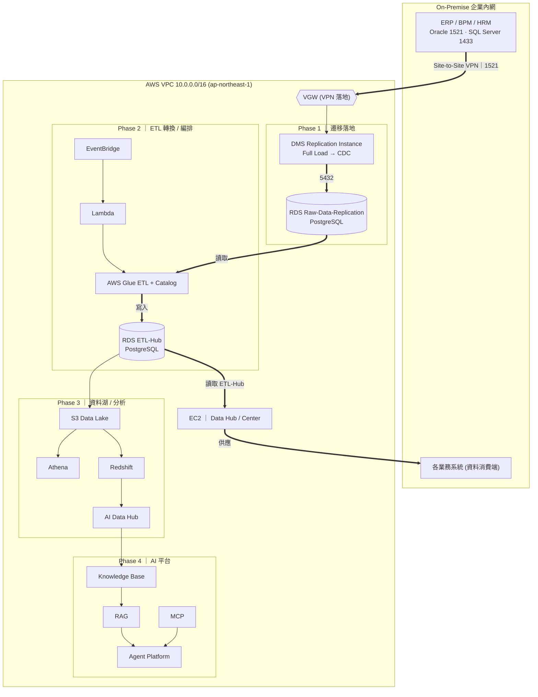
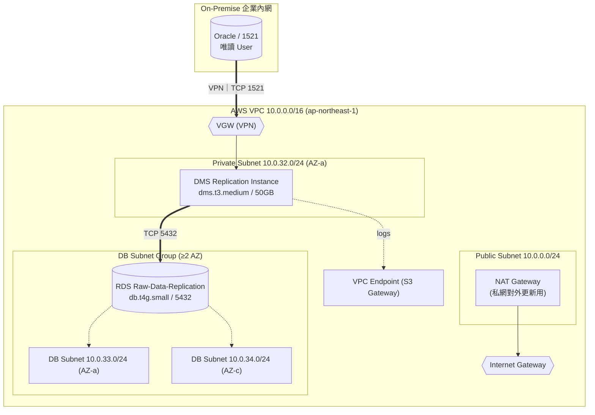
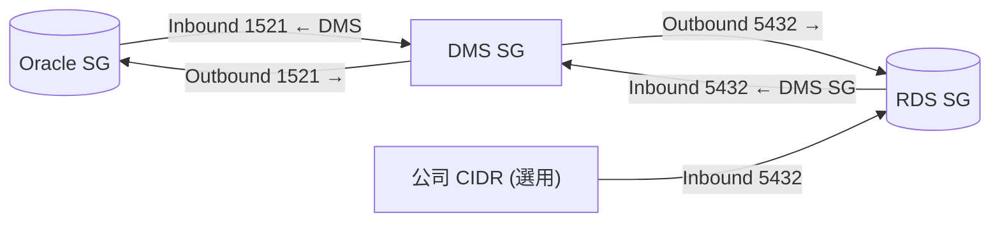
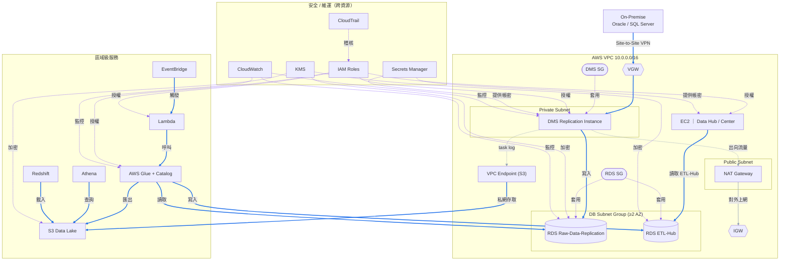
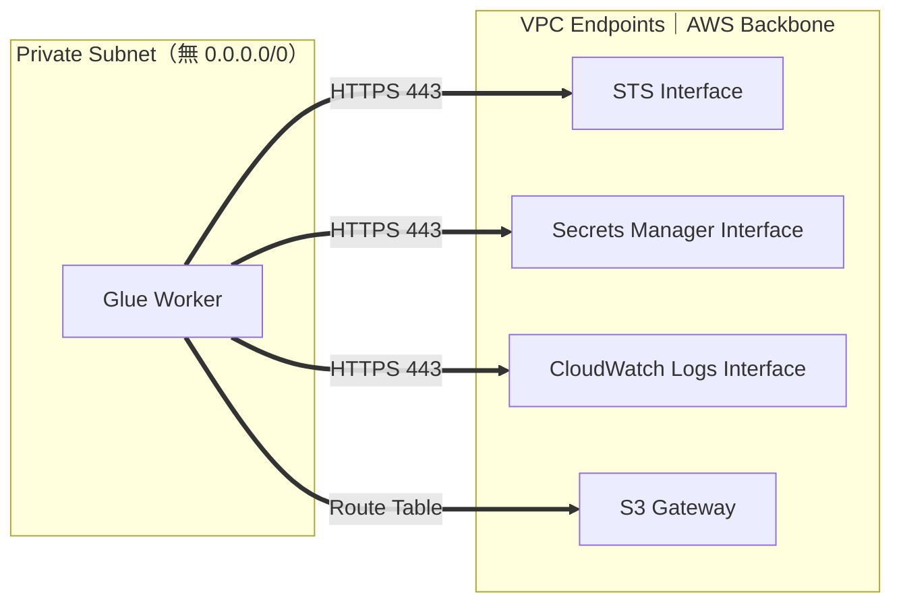
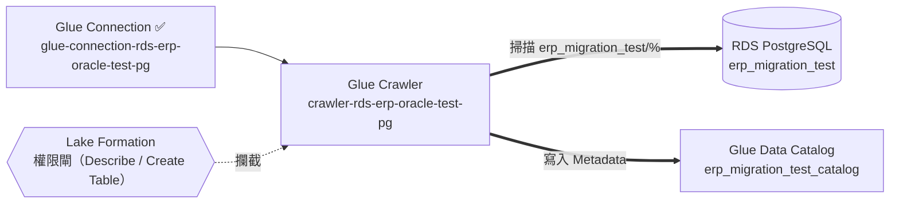
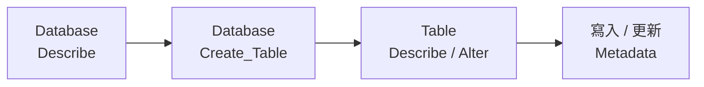

# Enterprise Data Hub — 地端 → AWS 資料中樞架構

> **性質**：長期架構規劃，核心交付為**架構圖**。以原始系統方向為骨幹，整合 Phase 1 實測成果，並補齊整體會用到的 AWS 設施與 Phase 2–4 未來規劃。
> **區域**：AWS 東京 `ap-northeast-1`（AZ 1a / 1c）。
> 架構圖報告版（可縮放 / 可列印）：[`aws-to-local-infra-arch.html`](aws-to-local-infra-arch.html)

> **章節導覽（依 Phase 分類）**
> - **總覽**：〈I〉目標 ·〈II〉端到端架構圖
> - **Phase 1 · 基礎建設**：〈III〉VPC 網路拓撲（含 SG）·〈VI〉Phase 1 關鍵參數 ·〈VII〉Phase 1 流程圖
> - **Phase 2 · ETL / Glue**：〈VIII〉Glue 前置：VPC Endpoints ·〈IX〉Glue Crawler + Data Catalog（Lake Formation 權限）·〈X〉Phase 2 流程圖
> - **跨階段 / 參考**：〈IV〉整體 AWS 設施 ·〈V〉設施關聯圖 ·〈XI〉名詞解說

---

## I、目標

規劃地端資料庫同步至雲端機器架構，含資料**複製 / 移轉 / Hub / Center**。

### 系統架構流程

1. 地端資料透過 **Migration**（DMS）移轉至 AWS RDS（名為 **Raw-Data-Replication**）
2. 透過 **AWS Glue** 進行 ETL 轉換寫回 RDS（名為 **ETL-Hub**）
3. **Data Hub** 讀取 ETL-Hub 的資料供各業務系統應用
4. **AWS EC2** 設置（Data Hub / Center 運算）

### 原始建置步驟

1. ERP / BPM / HRM Data（Oracle / SQL Server）
2. AWS VPC（連線企業內網，`10.0.0.0/16`）
3. AWS VPC Subnet（AZ：東京 1a、1c）
4. AWS VPC Route Table（關聯 Subnet，並加入 `10.200.0.0` 與 `10.240.0.0` 網段）
5. AWS Security Group 設定
6. AWS RDS 設定
7. AWS DMS 設定

> Phase 1 實測先以 **Oracle → Raw-Data-Replication（PostgreSQL RDS）Full Load** 驗證；SQL Server 與 CDC 在後續階段納入。

---

## II、端到端總架構圖（核心）

涵蓋全 Phase 資料流：地端來源 → 遷移 → Raw → ETL → Hub → 業務 / 分析 / AI。



---

## III、Phase 1 VPC 網路拓撲（實測成果）

本期已驗證：`Oracle → VPN → DMS → Raw-Data-Replication(RDS)` Full Load。每個 CIDR / 元件標示用途。



ASCII（標示用途）：

```
On-Premise Oracle (企業內網)
        │  TCP 1521  ← 來源資料庫(唯讀 User)
   ┌────┴─────────────┐
   │ Site-to-Site VPN │  ← 地端 ↔ 雲端 加密通道
   └────┬─────────────┘
        ▼
AWS VPC 10.0.0.0/16                          用途：整體雲端私有網路
  ├─ Internet Gateway (IGW)                  用途：公網入口(僅 Public 使用)
  ├─ VGW                                     用途：VPN 落地閘道
  ├─ Public Subnet 10.0.0.0/24
  │    └─ NAT Gateway                        用途：私網對外更新/呼叫 AWS API
  ├─ Private Subnet 10.0.32.0/24 (AZ-a)      用途：DMS 主機
  │    └─ DMS Replication Instance
  │            │ TCP 5432
  └─ DB Subnet Group (≥2 AZ)                 用途：RDS 高可用
       ├─ DB Subnet 10.0.33.0/24 (AZ-a)
       ├─ DB Subnet 10.0.34.0/24 (AZ-c)
       └─ RDS Raw-Data-Replication (db.t4g.small / 5432 / Public Access=No)
```

### Security Group 資料流（方向）



---

## IV、整體使用到的 AWS 設施（清單）

> 只給系統方向，但實際落地必須的設施一併納入規劃。

### 網路 / 連線

| 設施 | 用途 | Phase |
| --- | --- | --- |
| VPC `10.0.0.0/16` | 整體私有網路 | 1 |
| Public / Private / DB Subnet（1a / 1c） | 分層隔離 | 1 |
| Internet Gateway | 公網入口（僅 Public） | 1 |
| NAT Gateway | 私網對外（套件更新 / 呼叫 AWS API） | 1 |
| VGW + Site-to-Site VPN | 地端 ↔ 雲端 | 1 |
| Route Table（Local / VGW / NAT） | 路由（只增不刪既有） | 1 |
| Security Group（Oracle / DMS / RDS / EC2 / Glue） | 流量控管（禁 `0.0.0.0/0`） | 1 |
| VPC Endpoint（S3 Gateway） | 私網存取 S3 不繞公網 | 1–3 |

### 遷移 / 資料

| 設施 | 用途 | Phase |
| --- | --- | --- |
| DMS Replication Instance + Endpoints | Oracle/SQL Server → RDS（Full Load → CDC） | 1→2 |
| RDS Raw-Data-Replication（PostgreSQL） | 原始複製落地 | 1 |
| RDS ETL-Hub（PostgreSQL） | ETL 轉換後資料 | 2 |
| DB Subnet Group（≥2 AZ） | RDS 高可用 | 1 |

### 轉換 / 編排 / 運算

| 設施 | 用途 | Phase |
| --- | --- | --- |
| AWS Glue（Jobs / Crawler / Data Catalog） | Raw → ETL-Hub 轉換 | 2 |
| EventBridge | 排程觸發 ETL | 2 |
| Lambda | 流程編排 / 輕量處理 | 2 |
| EC2 | Data Hub / Center 應用 | 1–2 |

### 分析 / AI

| 設施 | 用途 | Phase |
| --- | --- | --- |
| S3 Data Lake | 集中儲存 | 3 |
| Athena | 即席查詢 | 3 |
| Redshift | 資料倉儲 / BI | 3 |
| AI Data Hub | 分析資料中樞 | 3 |
| AI Knowledge Base / RAG / MCP / Agent Platform | AI 應用層 | 4 |

### 安全 / 維運（跨階段共用）

| 設施 | 用途 |
| --- | --- |
| IAM Role（DMS / Glue / Lambda / EC2） | 最小權限存取 |
| Secrets Manager | DB 帳密集中管理 |
| KMS | 靜態加密金鑰 |
| CloudWatch（Logs / Metrics / Alarms） | DMS / Glue / RDS 監控告警 |
| CloudTrail | API 稽核 |

---

## V、設施關聯圖

各 AWS 設施之間的關係：包含 / 套用 / 授權 / 提供帳密 / 加密 / 監控 / 讀寫。線條配色：**藍=資料流**、**灰=基礎連線**、**紫=安全治理（SG / IAM / KMS / CloudWatch）**。



> 各階段範圍對照見〈IV、整體使用到的 AWS 設施〉的 Phase 欄。

---

## VI、Phase 1 關鍵參數（實測）

- **VPC/Subnet**：VPC `10.0.0.0/16`；Private `10.0.32.0/24`(AZ-a)；DB `10.0.33.0/24`(AZ-a)、`10.0.34.0/24`(AZ-c)。DB Subnet Group ≥2 AZ。
- **Route Table**：`10.0.0.0/16`→Local、`10.200.0.0/16`→VGW、`10.240.0.0/16`→VGW（**只增不移除**）。
- **Security Group**：Oracle In 1521←DMS；DMS Out 1521→Oracle / 5432→RDS；RDS In 5432←DMS SG（+公司 CIDR 選用）。**禁 `0.0.0.0/0`**。
- **RDS**：PostgreSQL `db.t4g.small`、gp3 20GB（只增不減）、Single-AZ(Dev)、Public Access=No。
- **DMS**：`dms.t3.medium`/50GB/Private Subnet；Task = Full Load / Drop tables / Limited LOB 32KB / Validation Off。
- **Oracle Endpoint**：1521 / 唯讀 User（非 SYS/SYSTEM）；`dba_registry` 錯誤 → 套最小權限 SQL（見附錄）。
- **Table Mapping**：白名單只含 `DS.*`、`M2201.*`，不同步其他 Schema。

---

## VII、Phase 1 流程圖

依「網路底層 → 資料庫 → 遷移」三層,一次一步、完成驗證再下一步。每一步的關鍵設定對齊〈VI、Phase 1 關鍵參數〉。

```mermaid
flowchart LR
  subgraph NET["① 網路層（順序不可跳）"]
    direction TB
    VPC["1. VPC ｜ 10.0.0.0/16"]
    SUB["2. Subnet<br/>Public 10.0.0.0/24 · Private 10.0.32.0/24(AZ-a)<br/>DB 10.0.33.0/24(AZ-a) · 10.0.34.0/24(AZ-c)"]
    VPN["3. VGW + Site-to-Site VPN<br/>地端 ↔ 雲端 IPsec"]
    RT["4. Route Table<br/>10.0.0.0/16→Local · 10.200/10.240→VGW（只增不刪）"]
    SG["5. Security Group<br/>Oracle/DMS/RDS 互引用 · 禁 0.0.0.0/0"]
    VPC --> SUB --> VPN --> RT --> SG
  end
  subgraph DBL["② 資料庫層"]
    direction TB
    DBG["DB Subnet Group（≥2 AZ）"]
    RDS["6. RDS Raw-Data-Replication<br/>PostgreSQL db.t4g.small · gp3 20GB · 5432 · Public=No"]
    DBG --> RDS
  end
  subgraph MIG["③ 遷移層"]
    direction TB
    DMS["7. DMS Replication Instance<br/>dms.t3.medium · 50GB · Private Subnet"]
    EP["8. Endpoints + 測試<br/>Source Oracle 1521(唯讀) · Target PostgreSQL 5432"]
    TM["Table Mapping 白名單<br/>DS.* · M2201.*"]
    TASK["9. Migration Task<br/>Full Load · Drop tables · LOB 32KB · Validation Off"]
    VER["10. 驗證同步<br/>比對筆數 / 抽樣核對"]
    DMS --> EP --> TM --> TASK --> VER
  end
  SG ==> DBG
  RDS ==> DMS
```



### 逐步明細

| # | 步驟 | 元件 / 服務 | 關鍵設定 | 目的 |
| --- | --- | --- | --- | --- |
| 1 | 建 VPC | VPC | `10.0.0.0/16` | 整體雲端私有網路容器 |
| 2 | 切 Subnet | Public / Private / DB Subnet | Public `10.0.0.0/24`、Private `10.0.32.0/24`(AZ-a)、DB `10.0.33.0/24`(AZ-a)+`10.0.34.0/24`(AZ-c) | 分層隔離;DB 跨 2 AZ 供 RDS 高可用 |
| 3 | 建 VGW + VPN | VGW / Site-to-Site VPN | IPsec、對接地端閘道 | 地端 ↔ 雲端加密通道 |
| 4 | 設 Route Table | Route Table | `10.0.0.0/16`→Local、`10.200.0.0/16`+`10.240.0.0/16`→VGW | 導向地端網段(**只增不刪**既有) |
| 5 | 設 Security Group | SG(Oracle / DMS / RDS) | Oracle In 1521←DMS;DMS Out 1521→Oracle、5432→RDS;RDS In 5432←DMS SG;**禁 `0.0.0.0/0`** | 執行個體層防火牆,以 SG 互引取代固定 IP |
| 6 | 建 RDS | RDS Raw-Data-Replication + DB Subnet Group | PostgreSQL `db.t4g.small`、gp3 20GB(只增不減)、Single-AZ(Dev)、Public Access=No | 原始複製落地目標 |
| 7 | 建 DMS 主機 | DMS Replication Instance | `dms.t3.medium`、50GB、置於 Private Subnet | 執行遷移的運算資源 |
| 8 | 建 Endpoints + 測試 | Source / Target Endpoint | Oracle 1521 唯讀 User(非 SYS/SYSTEM)、Target PostgreSQL 5432;先 Test connection | 建立來源 / 目標連線並驗通 |
| 9 | 建 Migration Task | DMS Task + Table Mapping | Full Load / Drop tables on target / Limited LOB 32KB / Validation Off;白名單 `DS.*`、`M2201.*` | 全量複製指定 Schema |
| 10 | 驗證同步 | — | 比對來源 / 目標筆數、抽樣核對欄位 | 確認落地正確、資料無漏 |

---

## 附錄 — Oracle 最小權限 SQL

```sql
-- 請以具 DBA 權限者執行;&DMS_USER 換成實際唯讀帳號
GRANT CREATE SESSION   TO &DMS_USER;
GRANT SELECT ANY TABLE TO &DMS_USER;
GRANT SELECT ON SYS.V_$DATABASE      TO &DMS_USER;
GRANT SELECT ON SYS.DBA_REGISTRY     TO &DMS_USER;   -- 解決 dba_registry 錯誤
GRANT SELECT ON SYS.DBA_TABLES       TO &DMS_USER;
GRANT SELECT ON SYS.DBA_TAB_COLUMNS  TO &DMS_USER;
GRANT SELECT ON SYS.DBA_OBJECTS      TO &DMS_USER;
GRANT SELECT ON SYS.DBA_CONSTRAINTS  TO &DMS_USER;
GRANT SELECT ON SYS.DBA_INDEXES      TO &DMS_USER;
```

## Troubleshooting（速查）

- **Connection Timeout**：DNS → Test-NetConnection 5432 → Security Group → Route Table → VPN CIDR → NACL。
- **Endpoint Test Failed**：Oracle → Network → Security Group → Permission → Version。

---

## VIII、Phase 2 ｜ Glue 前置：VPC Endpoints

> **Phase 2 · ETL / Glue** — 建立 AWS Glue 的前置作業。

Phase 2 要用 AWS Glue 把 Raw 轉成 ETL-Hub。Glue Worker 跑在 Private Subnet,呼叫 AWS API 會因無對外路由而失敗 → 用 **VPC Endpoint 走 AWS Backbone** 解決,而非開 NAT Gateway。

### 問題：Glue Connection 失敗

建立 Glue Connection 時報:

```
Failed to assume customer's role
Verify that your VPC has access to STS
```

根因:Glue Worker 在 Private Subnet;Route Table 只有 `local` + VGW(`10.200/10.240`→地端),**沒有 `0.0.0.0/0`** → 連不到 `sts.ap-northeast-1.amazonaws.com` → AssumeRole 失敗。

### 解法：VPC Endpoint（不用 NAT Gateway）

企業 Data Center 是 Private Network,不希望 Private Subnet 透過 NAT 對外上網 → 改走 AWS Backbone。



### 建置步驟（實作除錯紀錄）

逐一補齊缺的 Endpoint,每補一個就往前推進一個錯誤,直到全部到位。

| Step | 動作 | 結果 / 錯誤 |
| --- | --- | --- |
| 1 | 建 Glue Connection(PostgreSQL;同 RDS 的 VPC、Private Subnet-A/C;初期先用 RDS SG) | 建立連線設定 |
| 2 | 測試連線 | ❌ `Failed to assume customer's role / access to STS` — 私網無法連 sts |
| 3 | 建 **STS** Interface Endpoint(Private DNS on、Subnet-A/C、SG-VPCE-AWS-Services) | 可 AssumeRole |
| 4 | 再測 | ❌ `Unable to connect to Secrets Manager` — Glue 憑證存在 Secrets Manager |
| 5 | 建 **Secrets Manager** Interface Endpoint(設定同 STS) | 可讀連線憑證 |
| 6 | 建 **CloudWatch Logs** Interface Endpoint(Glue Job 寫執行日誌) | 可寫 Job log |
| 7 | 建 **S3** _Gateway_ Endpoint(不是 Interface!改 Route Table `RT-ERP-Hub-Test-DB`,AWS 自動加 Prefix List `pl-xxxx`) | 可存取 S3 |
| 8 | 建共用 `SG-VPCE-AWS-Services`(Inbound 443 ← Glue SG;Outbound All) | Endpoint 流量放行 |
| 9 | 核對 VPC Endpoint 總表(見下) | 4 個到位 |
| 10 | 回 Glue 測試連線 | ✅ `Connection is ready for you to use` |

> 四個 Endpoint 的角色:到位後 Glue 才能完整 AssumeRole(STS)→ 讀憑證(Secrets Manager)→ 寫日誌(CloudWatch Logs)→ 存取 S3,並連上 PostgreSQL RDS。

| 對照 | NAT Gateway | VPC Endpoint（採用） |
| --- | --- | --- |
| 路徑 | 經公網對外 | AWS 內部 Backbone |
| 對外暴露面 | 私網可連整個 Internet | 只到指定 AWS 服務 |
| 符合 Private First | ✗ | ✓ |

### VPC Endpoint 總表

Required 四項為 Glue 運行所需(Private DNS Enabled、佈於 Subnet-A / Subnet-C);Optional 依後續服務需要再加。

| 類別 | 服務 | 型態 | 命名 |
| --- | --- | --- | --- |
| Required | STS | Interface | `vpce-sts` |
| Required | Secrets Manager | Interface | `vpce-secretsmanager` |
| Required | CloudWatch Logs | Interface | `vpce-cloudwatchlogs` |
| Required | S3 | Gateway | `vpce-s3` |
| Optional | KMS | Interface | — |
| Optional | ECR API / ECR DKR | Interface | —（容器映像） |
| Optional | SSM | Interface | — |

- **Interface Endpoint**:建 ENI、吃 SG、走 Private DNS(STS / Secrets / Logs / KMS / ECR)。
- **Gateway Endpoint**(S3 專用):不建 ENI、不吃 SG、改 Route Table(AWS 自動加 Prefix List `pl-xxxx` → Gateway Endpoint)。

### Security Group 策略（Role-Based）

以角色切 SG,而非每個 App 一個。新增 `SG-VPCE-AWS-Services` 給所有 AWS Interface Endpoint 共用(STS / Secrets / Logs / KMS / ECR),因為都走 HTTPS 443 與 AWS API 通訊 → 共用降低維護成本。

- **Inbound**:HTTPS 443,Source = `SG-ETL-Glue`(未來 DMS / Taskiq 可加入)
- **Outbound**:All Traffic

規劃 SG 清單:`SG-DB-RDS`、`SG-ETL-Glue`、`SG-ETL-DMS`、`SG-APP-Taskiq`、`SG-VPCE-AWS-Services`。

### 命名規範

- **Security Group**:`SG-DB-RDS`、`SG-ETL-Glue`、`SG-ETL-DMS`、`SG-APP-Taskiq`、`SG-VPCE-AWS-Services`
- **VPC Endpoint**:`vpce-sts`、`vpce-secretsmanager`、`vpce-cloudwatchlogs`、`vpce-s3`

### Glue Workflow（規劃）

`Glue Connection → Database → Crawler → Data Catalog → Visual ETL → S3 → Athena → Redshift → AI Platform → Data Hub`

### 設計原則

- **Private First**:核心服務全部署於 Private Subnet。
- **Least Privilege**:Security Group 依角色切分,非全服務共用。
- **AWS Backbone**:透過 VPC Endpoint 存取 AWS API,不繞 NAT Gateway。
- **Scalable**:後續 Athena / Redshift / EMR / ECS / Lambda / AI Platform 免重設計 VPC。

---

## IX、Phase 2 ｜ Glue Crawler + Data Catalog（Lake Formation 權限）

> **Phase 2 · ETL / Glue** — VPC Endpoint 到位、Glue Connection Ready 後,建 Crawler 掃描 RDS PostgreSQL,把 Metadata 寫入 Glue Data Catalog。此階段的關卡不在網路,而在 **Lake Formation 權限模型**。

Glue Workflow 推進到 `Glue Connection ✅ → Crawler → Data Catalog`:讓 Crawler 掃 `erp_migration_test`,把表結構寫入 Glue Database `erp_migration_test_catalog`。

### 目標流程



### 問題:Crawler 卡 Lake Formation 權限

Crawler 執行後持續報:

```
Insufficient Lake Formation permission(s):
Required Describe on erp_migration_test_ds_aaa_file
(Database: erp_migration_test_catalog)
```

Glue Catalog `Tables = 0` — 一張 Metadata 都沒建成。

### 錯誤演進(逐階段推進)

每修正一層,錯誤就往前推一步,逐步逼近真正的缺口。

| 階段 | 錯誤訊息 | 真正原因 |
| --- | --- | --- |
| 1 | `Crawler cannot be started / Verify the permissions in the IAM role` | **不是 IAM** — 是 Glue Connection 用錯 Subnet |
| 2 | `Required Describe on erp_migration_test_catalog` | 缺 **Database** 層權限 |
| 3 | `Required Describe on erp_migration_test_ds_aaa_file` | 開始檢查 **Table** 層權限 |
| 4 | 刪 Database → `Required Drop on erp_migration_test_catalog` | 鐵證:該 DB 已由 **Lake Formation 接管** |

### 根因:Database 已被 Lake Formation 接管

1. **「Use only IAM access control」預設不回溯**:只對「設定啟用後新建、且仍持有 `IAMAllowedPrincipals`」的資源生效;既有 DB 不受惠。
2. **明確 Grant 會移除 `IAMAllowedPrincipals`**:一旦對該 DB 的 Table/Column 下明確 LF Grant,Lake Formation 就把 `IAMAllowedPrincipals` 移除 → 資源翻轉成「LF 管控」→ 所有 principal(含 Crawler)都要明確 LF 授權。
3. **只 Grant 了 Table + Column,缺 Database 層**(Describe + Create Table)→ Crawler 第一關就進不了。

> 第四階段刪 DB 需 `Required Drop`,正是「DB 已被 LF 接管、連 Data Lake Admin 都要明確授權」的鐵證。

### Crawler 授權檢查順序



第一關 Database Describe 過不了,錯誤會往下傳到正在處理的 table,所以看到的是「table 的 Required Describe」,但真正缺口在 Database 層。

### 解法:Lake Formation 三層權限模型(非破壞性)

對 Principal `Glue-ServiceRole-ERP-Hub` 補齊三層 Grant,**不刪 DB**:

| Resource | 名稱 | Permissions |
| --- | --- | --- |
| **Database** | `erp_migration_test_catalog` | Describe · Create Table · Alter |
| **Table** | `ALL_TABLES` | Describe · Select · Insert · Alter · Delete（Drop 選用） |
| **Column** | `ALL_COLUMNS` | Select |

> ⚠️ 不走「刪 DB 讓預設重建」那條路:刪除屬破壞性(且此 DB 已被 LF 管控要 `Drop` 權限)。**補 Database Grant 才是最小、最安全的修法**,補齊後根本不需要重建。

### 結果

補上 Database 層後重跑 Crawler → `Tables > 0`,Metadata 建立成功 → 進入下一步 **Visual ETL**。

### 已排除(非主因)

`IAM` / `Secrets Manager` / `VPC` / `Route Table` / `Security Group` / `Glue Connection` / `PostgreSQL Authentication` / `Hybrid Access Mode` — 皆已驗證正常。Connection Test / `GetSecretValue` / `GetConnection` 全 Success 只證明「連得到 DB、拿得到憑證」,與「能否寫進 Glue Catalog」是兩條獨立授權鏈;問題單純在 **Data Catalog 的 Lake Formation 授權鏈**。

---

## X、Phase 2 流程圖

> **Phase 2 · ETL / Glue** — 承接 Phase 1 落地的 Raw-Data-Replication,把 Glue 前置到 Crawler 建 Metadata 的完整順序整理成流程圖。做法與 Phase 1 一致:一次一步、完成驗證再下一步。

依「① 網路前置(VPC Endpoints)→ ② Glue 連線 / 掃描 → ③ Lake Formation 權限 → ④ ETL 轉換」四層推進。

```mermaid
flowchart LR
  subgraph EP["① 網路前置層（VPC Endpoints）"]
    direction TB
    SGV["1. SG-VPCE-AWS-Services<br/>Inbound 443 ← SG-ETL-Glue"]
    IEP["2. Interface Endpoints<br/>STS · Secrets Manager · CloudWatch Logs<br/>（Private DNS on · Subnet-A/C）"]
    GEP["3. S3 Gateway Endpoint<br/>改 Route Table（Prefix List pl-xxxx）"]
    SGV --> IEP --> GEP
  end
  subgraph GL["② Glue 連線 / 掃描層"]
    direction TB
    CONN["4. Glue Connection<br/>PostgreSQL · 同 RDS VPC/Subnet · SG-ETL-Glue"]
    GDB["5. Glue Database<br/>erp_migration_test_catalog"]
    CR["6. Glue Crawler<br/>Include erp_migration_test/% · On-Demand"]
    CONN --> GDB --> CR
  end
  subgraph LF["③ Lake Formation 權限層"]
    direction TB
    DBG["7. Grant Database<br/>Describe · Create Table · Alter"]
    TBG["8. Grant Table / Column<br/>ALL_TABLES · ALL_COLUMNS"]
    RUN["9. 執行 Crawler → 驗證<br/>Tables > 0"]
    DBG --> TBG --> RUN
  end
  subgraph ET["④ ETL 轉換層（後續）"]
    direction TB
    ETLJ["10. Visual ETL Job<br/>Raw → 轉換 → ETL-Hub"]
    SCH["11. 排程編排<br/>EventBridge → Lambda"]
    ETLJ --> SCH
  end
  GEP ==> CONN
  CR ==> DBG
  RUN ==> ETLJ
```



### 逐步明細

| # | 步驟 | 元件 / 服務 | 關鍵設定 | 目的 |
| --- | --- | --- | --- | --- |
| 1 | 建共用 SG | SG-VPCE-AWS-Services | Inbound `443` ← `SG-ETL-Glue`;Outbound All | 放行 Glue → Endpoint 流量 |
| 2 | 建 Interface Endpoints | STS / Secrets Manager / CloudWatch Logs | Private DNS on、佈於 Subnet-A/C、掛 `SG-VPCE-AWS-Services` | 私網走 Backbone:AssumeRole / 讀憑證 / 寫 log |
| 3 | 建 S3 Gateway Endpoint | S3(Gateway) | 改 Route Table `RT-ERP-Hub-Test-DB`(自動加 Prefix List `pl-xxxx`) | 私網存取 S3 不繞公網 |
| 4 | 建 Glue Connection + 測試 | Glue Connection(PostgreSQL) | 同 RDS VPC、Private Subnet-A/C、`SG-ETL-Glue`;先 Test connection | 建立並驗通 Glue → RDS 連線 |
| 5 | 建 Glue Database | Data Catalog Database | `erp_migration_test_catalog` | Crawler 寫入 Metadata 的目標 |
| 6 | 建 Glue Crawler | Glue Crawler | Source PostgreSQL、Include `erp_migration_test/%`、IAM Role `Glue-ServiceRole-ERP-Hub`、On-Demand | 掃描來源結構 |
| 7 | Grant Database 權限 | Lake Formation | Principal `Glue-ServiceRole-ERP-Hub`;Database **Describe + Create Table + Alter** | 讓 Crawler 進得了 Database 層(關鍵缺口) |
| 8 | Grant Table / Column | Lake Formation | `ALL_TABLES`(Describe/Select/Insert/Alter/Delete)、`ALL_COLUMNS`(Select) | 讓 Crawler 建 / 改表 Metadata |
| 9 | 執行 Crawler + 驗證 | Glue Crawler | On-Demand Run → 查 Data Catalog | 確認 `Tables > 0`、Metadata 建立成功 |
| 10 | 建 Visual ETL Job | Glue ETL(後續) | Source = Catalog → 轉換 → Target RDS `ETL-Hub` | Raw → ETL-Hub 清洗轉換 |
| 11 | 排程編排 | EventBridge + Lambda(後續) | 定時觸發 ETL / 流程編排 | 自動化 ETL 執行 |

> **目前進度**:Step 1–9 已完成並驗證 — Crawler 與 Data Catalog 已產出,`Tables > 0`、Metadata 建立成功;Step 10–11(Visual ETL / 排程)為下一步規劃。

---

## XI、名詞解說

### 網路 / 連線

| 名詞 | 全稱 / 類型 | 說明 |
| --- | --- | --- |
| VPC | Virtual Private Cloud | AWS 私有虛擬網路（`10.0.0.0/16`），隔離所有資源 |
| CIDR | 網段表示法 | 如 `10.0.32.0/24`，劃分子網範圍 |
| AZ | Availability Zone | 區域內物理隔離機房（東京 1a / 1c） |
| Subnet | 子網 | Public（對外）/ Private（DMS）/ DB（RDS） |
| IGW | Internet Gateway | VPC 對公網入口（僅 Public 用） |
| NAT Gateway | 網路位址轉換閘道 | 私網「只出不進」連外 |
| VGW | Virtual Private Gateway | VPC 端 VPN 落地閘道 |
| Site-to-Site VPN | 站對站 VPN | 地端 ↔ AWS IPsec 加密通道 |
| Route Table | 路由表 | 決定封包流向（只增不刪既有） |
| Security Group | 安全群組 | 執行個體層防火牆（方向 + Port + 來源） |
| NACL | Network ACL | 子網層無狀態防火牆 |
| VPC Endpoint | VPC 端點 | 私網不繞公網存取 S3 / STS 等 AWS 服務(走 AWS Backbone) |

### VPC Endpoint / Glue 前置（Phase 2）

| 名詞 | 全稱 / 類型 | 說明 |
| --- | --- | --- |
| STS | Security Token Service | 發放臨時安全憑證;AssumeRole 靠它換取角色權限 |
| AssumeRole | 取得角色臨時憑證 | 服務(如 Glue)啟動時向 STS 換取 IAM Role 臨時權限 |
| Interface Endpoint | VPC 端點(ENI 型) | 建 ENI、吃 SG、走 Private DNS(STS / Secrets / Logs 等) |
| Gateway Endpoint | VPC 端點(路由型) | S3 專用,改 Route Table、不建 ENI / 不吃 SG |
| ENI | Elastic Network Interface | 彈性網卡;Interface Endpoint 在子網內的網路介面 |
| Private DNS | 私有 DNS 解析 | 讓 AWS 服務網域自動解析到 Endpoint 私有 IP |
| Glue Connection | Glue 連線設定 | Glue 連 RDS / 資料源,含 VPC / Subnet / SG |
| Glue Crawler | 爬蟲 | 掃描資料源結構,寫入 Data Catalog |
| ECR | Elastic Container Registry | 容器映像倉庫;跑容器化任務時需要(選用) |
| SSM | Systems Manager | 參數 / 遠端管理(選用 Endpoint) |

### 遷移 / 資料庫

| 名詞 | 全稱 / 類型 | 說明 |
| --- | --- | --- |
| DMS | Database Migration Service | 資料庫遷移服務 |
| Replication Instance | DMS 複寫主機 | 執行遷移的運算資源（`dms.t3.medium`） |
| Full Load | 全量載入 | 一次性整批複製既有資料（Phase 1） |
| CDC | Change Data Capture | 持續同步增刪改（Phase 2） |
| Endpoint | 來源 / 目標端點 | DMS 連線設定（Host/Port/帳密） |
| Table Mapping | 表對應規則 | 白名單指定同步 Schema（`DS.*` 等） |
| LOB | Large Object | 大型欄位；Limited LOB 32KB |
| RDS | Relational Database Service | 託管關聯式資料庫（皆 PostgreSQL） |
| DB Subnet Group | 資料庫子網群組 | 須含 ≥2 AZ |
| Multi-AZ | 多可用區部署 | 另一 AZ 待命副本，自動切換 |
| gp3 | SSD 儲存類型 | 通用型 SSD，可線上擴充（只增不減） |

### 轉換 / 編排 / 運算

| 名詞 | 全稱 / 類型 | 說明 |
| --- | --- | --- |
| AWS Glue | 無伺服器 ETL | Raw → ETL-Hub 轉換（Jobs/Crawler/Catalog） |
| ETL | Extract-Transform-Load | 擷取 → 轉換 → 載入 |
| Data Catalog | 資料目錄 | Glue 維護的表結構 / 中繼資料 |
| Lake Formation | 資料湖權限治理 | 在 IAM 之上對 Glue Catalog 的 Database / Table / Column 做細粒度授權 |
| IAMAllowedPrincipals | LF 相容群組 | 資源持有它時退回 IAM-only;被移除即翻轉成 LF 強制授權 |
| Data Lake Administrator | 資料湖管理員 | Lake Formation 最高權限者,可授權 / 撤銷各資源 |
| EventBridge | 事件匯流排 | 排程 / 事件觸發 ETL |
| Lambda | 無伺服器函式 | 流程編排 / 輕量處理 |
| EC2 | Elastic Compute Cloud | 虛擬主機（Data Hub / Center） |

### 分析 / AI

| 名詞 | 全稱 / 類型 | 說明 |
| --- | --- | --- |
| S3 Data Lake | 物件儲存資料湖 | 集中低成本儲存（Phase 3） |
| Athena | 互動式查詢 | 直接對 S3 用 SQL 查詢 |
| Redshift | 資料倉儲 | 大規模分析 / BI 欄式倉儲 |
| RAG | Retrieval-Augmented Generation | 檢索增強生成，降低幻覺 |
| MCP | Model Context Protocol | AI Agent 標準化存取外部工具 / 資料 |
| Knowledge Base / Agent Platform | 知識庫 / 代理平台 | AI 應用層 |

### 安全 / 維運

| 名詞 | 全稱 / 類型 | 說明 |
| --- | --- | --- |
| IAM Role | 身分與存取角色 | 授予服務最小必要權限 |
| Secrets Manager | 機密管理 | 集中保管 DB 帳密 / 金鑰 |
| KMS | Key Management Service | 靜態加密金鑰管理 |
| CloudWatch | 監控服務 | Logs / Metrics / Alarms |
| CloudTrail | API 稽核 | 記錄 API 操作軌跡 |

### 專案自訂命名

| 名詞 | 說明 |
| --- | --- |
| Raw-Data-Replication | DMS 落地的「原始複製」RDS，保留來源樣貌、不轉換 |
| ETL-Hub | 經 Glue ETL 轉換後的 RDS，供業務 / 分析使用 |
| Data Hub / Center | 讀取 ETL-Hub 對外供應資料的應用層（EC2） |
