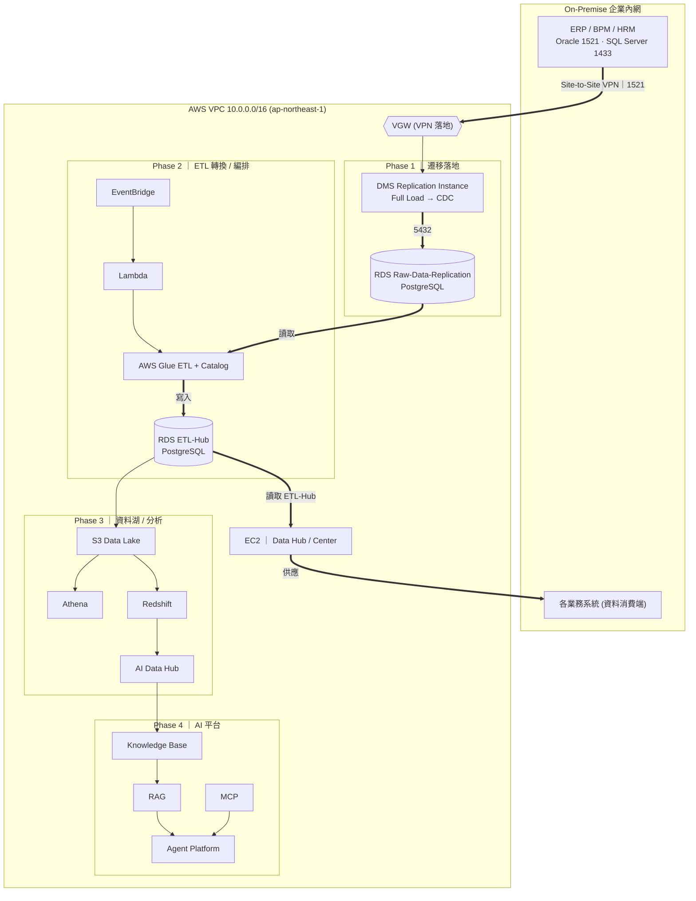
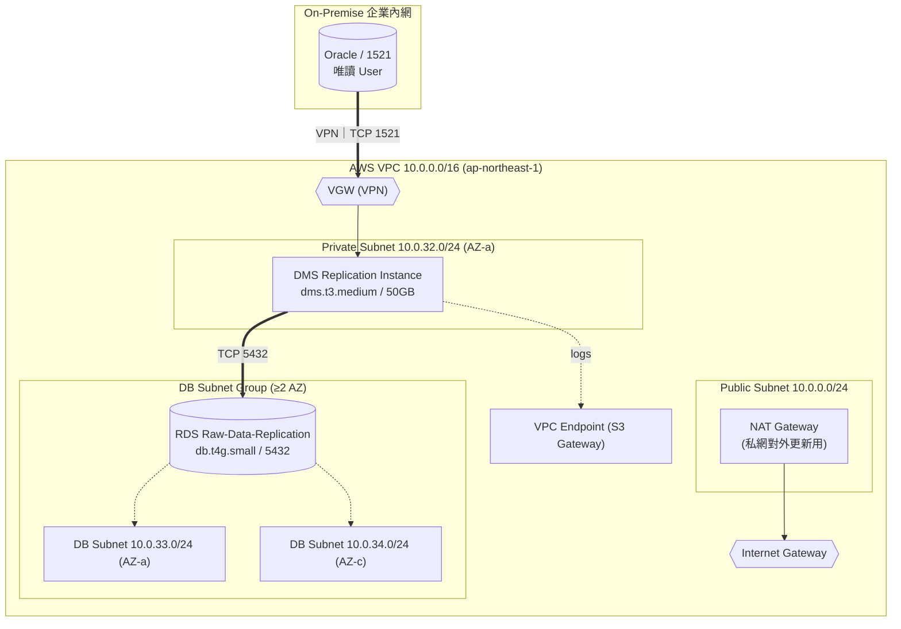
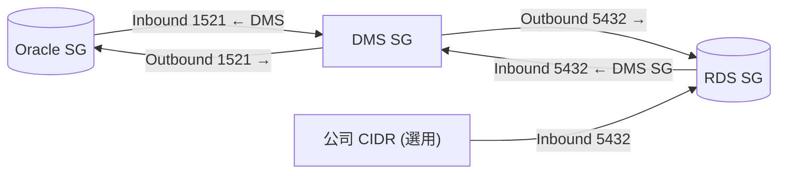
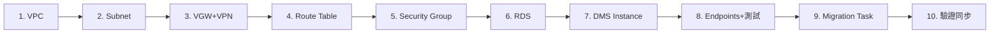

# Enterprise Data Hub — 地端 → AWS 資料中樞架構

> **性質**：長期架構規劃，核心交付為**架構圖**。以原始系統方向為骨幹，整合 Phase 1 實測成果，並補齊整體會用到的 AWS 設施與 Phase 2–4 未來規劃。
> **區域**：AWS 東京 `ap-northeast-1`（AZ 1a / 1c）。
> 架構圖報告版（可縮放 / 可列印）：[`aws-to-local-infra-arch.html`](aws-to-local-infra-arch.html)

---

## 一、目標

規劃地端資料庫同步至雲端機器架構，含資料**複製 / 移轉 / Hub / Center**。

### 系統架構流程

1. 地端資料透過 **Migration**（DMS）移轉至 AWS RDS（名為 **Raw-Data-Replication**）
2. 透過 **AWS Glue** 進行 ETL 轉換寫回 RDS（名為 **ETL-Hub**）
3. **Data Hub** 讀取 ETL-Hub 的資料供各業務系統應用
4. **AWS EC2** 設置（Data Hub / Center 運算）

### 原始建置步驟

1. ERP / BPM / HRM Data（Oracle / SQL Server）
2. AWS VPC（連線企業內網，`10.0.0.0/16`）
3. AWS VPC Subnet（AZ：東京 1a、1c）
4. AWS VPC Route Table（關聯 Subnet，並加入 `10.200.0.0` 與 `10.240.0.0` 網段）
5. AWS Security Group 設定
6. AWS RDS 設定
7. AWS DMS 設定

> Phase 1 實測先以 **Oracle → Raw-Data-Replication（PostgreSQL RDS）Full Load** 驗證；SQL Server 與 CDC 在後續階段納入。

---

## 二、端到端總架構圖（核心）

涵蓋全 Phase 資料流：地端來源 → 遷移 → Raw → ETL → Hub → 業務 / 分析 / AI。



---

## 三、Phase 1 VPC 網路拓撲（實測成果）

本期已驗證：`Oracle → VPN → DMS → Raw-Data-Replication(RDS)` Full Load。每個 CIDR / 元件標示用途。



ASCII（標示用途）：

```
On-Premise Oracle (企業內網)
        │  TCP 1521  ← 來源資料庫(唯讀 User)
   ┌────┴─────────────┐
   │ Site-to-Site VPN │  ← 地端 ↔ 雲端 加密通道
   └────┬─────────────┘
        ▼
AWS VPC 10.0.0.0/16                          用途：整體雲端私有網路
  ├─ Internet Gateway (IGW)                  用途：公網入口(僅 Public 使用)
  ├─ VGW                                     用途：VPN 落地閘道
  ├─ Public Subnet 10.0.0.0/24
  │    └─ NAT Gateway                        用途：私網對外更新/呼叫 AWS API
  ├─ Private Subnet 10.0.32.0/24 (AZ-a)      用途：DMS 主機
  │    └─ DMS Replication Instance
  │            │ TCP 5432
  └─ DB Subnet Group (≥2 AZ)                 用途：RDS 高可用
       ├─ DB Subnet 10.0.33.0/24 (AZ-a)
       ├─ DB Subnet 10.0.34.0/24 (AZ-c)
       └─ RDS Raw-Data-Replication (db.t4g.small / 5432 / Public Access=No)
```

### Security Group 資料流（方向）



---

## 四、整體使用到的 AWS 設施（清單）

> 只給系統方向，但實際落地必須的設施一併納入規劃。

### 網路 / 連線

| 設施 | 用途 | Phase |
| --- | --- | --- |
| VPC `10.0.0.0/16` | 整體私有網路 | 1 |
| Public / Private / DB Subnet（1a / 1c） | 分層隔離 | 1 |
| Internet Gateway | 公網入口（僅 Public） | 1 |
| NAT Gateway | 私網對外（套件更新 / 呼叫 AWS API） | 1 |
| VGW + Site-to-Site VPN | 地端 ↔ 雲端 | 1 |
| Route Table（Local / VGW / NAT） | 路由（只增不刪既有） | 1 |
| Security Group（Oracle / DMS / RDS / EC2 / Glue） | 流量控管（禁 `0.0.0.0/0`） | 1 |
| VPC Endpoint（S3 Gateway） | 私網存取 S3 不繞公網 | 1–3 |

### 遷移 / 資料

| 設施 | 用途 | Phase |
| --- | --- | --- |
| DMS Replication Instance + Endpoints | Oracle/SQL Server → RDS（Full Load → CDC） | 1→2 |
| RDS Raw-Data-Replication（PostgreSQL） | 原始複製落地 | 1 |
| RDS ETL-Hub（PostgreSQL） | ETL 轉換後資料 | 2 |
| DB Subnet Group（≥2 AZ） | RDS 高可用 | 1 |

### 轉換 / 編排 / 運算

| 設施 | 用途 | Phase |
| --- | --- | --- |
| AWS Glue（Jobs / Crawler / Data Catalog） | Raw → ETL-Hub 轉換 | 2 |
| EventBridge | 排程觸發 ETL | 2 |
| Lambda | 流程編排 / 輕量處理 | 2 |
| EC2 | Data Hub / Center 應用 | 1–2 |

### 分析 / AI

| 設施 | 用途 | Phase |
| --- | --- | --- |
| S3 Data Lake | 集中儲存 | 3 |
| Athena | 即席查詢 | 3 |
| Redshift | 資料倉儲 / BI | 3 |
| AI Data Hub | 分析資料中樞 | 3 |
| AI Knowledge Base / RAG / MCP / Agent Platform | AI 應用層 | 4 |

### 安全 / 維運（跨階段共用）

| 設施 | 用途 |
| --- | --- |
| IAM Role（DMS / Glue / Lambda / EC2） | 最小權限存取 |
| Secrets Manager | DB 帳密集中管理 |
| KMS | 靜態加密金鑰 |
| CloudWatch（Logs / Metrics / Alarms） | DMS / Glue / RDS 監控告警 |
| CloudTrail | API 稽核 |

---

## 五、設施關聯圖

各 AWS 設施之間的關係：包含 / 套用 / 授權 / 提供帳密 / 加密 / 監控 / 讀寫。線條配色：**藍=資料流**、**灰=基礎連線**、**紫=安全治理（SG / IAM / KMS / CloudWatch）**。


> 各階段範圍對照見〈四、整體使用到的 AWS 設施〉的 Phase 欄。

---

## 六、Phase 1 關鍵參數（實測）

- **VPC/Subnet**：VPC `10.0.0.0/16`；Private `10.0.32.0/24`(AZ-a)；DB `10.0.33.0/24`(AZ-a)、`10.0.34.0/24`(AZ-c)。DB Subnet Group ≥2 AZ。
- **Route Table**：`10.0.0.0/16`→Local、`10.200.0.0/16`→VGW、`10.240.0.0/16`→VGW（**只增不移除**）。
- **Security Group**：Oracle In 1521←DMS；DMS Out 1521→Oracle / 5432→RDS；RDS In 5432←DMS SG（+公司 CIDR 選用）。**禁 `0.0.0.0/0`**。
- **RDS**：PostgreSQL `db.t4g.small`、gp3 20GB（只增不減）、Single-AZ(Dev)、Public Access=No。
- **DMS**：`dms.t3.medium`/50GB/Private Subnet；Task = Full Load / Drop tables / Limited LOB 32KB / Validation Off。
- **Oracle Endpoint**：1521 / 唯讀 User（非 SYS/SYSTEM）；`dba_registry` 錯誤 → 套最小權限 SQL（見附錄）。
- **Table Mapping**：白名單只含 `DS.*`、`M2201.*`，不同步其他 Schema。

---

## 七、建置 SOP（Phase 1）



由網路底層 → 資料庫 → 遷移，一次一步、完成驗證再下一步。

---

## 附錄 — Oracle 最小權限 SQL

```sql
-- 請以具 DBA 權限者執行;&DMS_USER 換成實際唯讀帳號
GRANT CREATE SESSION   TO &DMS_USER;
GRANT SELECT ANY TABLE TO &DMS_USER;
GRANT SELECT ON SYS.V_$DATABASE      TO &DMS_USER;
GRANT SELECT ON SYS.DBA_REGISTRY     TO &DMS_USER;   -- 解決 dba_registry 錯誤
GRANT SELECT ON SYS.DBA_TABLES       TO &DMS_USER;
GRANT SELECT ON SYS.DBA_TAB_COLUMNS  TO &DMS_USER;
GRANT SELECT ON SYS.DBA_OBJECTS      TO &DMS_USER;
GRANT SELECT ON SYS.DBA_CONSTRAINTS  TO &DMS_USER;
GRANT SELECT ON SYS.DBA_INDEXES      TO &DMS_USER;
```

## Troubleshooting（速查）

- **Connection Timeout**：DNS → Test-NetConnection 5432 → Security Group → Route Table → VPN CIDR → NACL。
- **Endpoint Test Failed**：Oracle → Network → Security Group → Permission → Version。

---

## 八、名詞解說

### 網路 / 連線

| 名詞 | 全稱 / 類型 | 說明 |
| --- | --- | --- |
| VPC | Virtual Private Cloud | AWS 私有虛擬網路（`10.0.0.0/16`），隔離所有資源 |
| CIDR | 網段表示法 | 如 `10.0.32.0/24`，劃分子網範圍 |
| AZ | Availability Zone | 區域內物理隔離機房（東京 1a / 1c） |
| Subnet | 子網 | Public（對外）/ Private（DMS）/ DB（RDS） |
| IGW | Internet Gateway | VPC 對公網入口（僅 Public 用） |
| NAT Gateway | 網路位址轉換閘道 | 私網「只出不進」連外 |
| VGW | Virtual Private Gateway | VPC 端 VPN 落地閘道 |
| Site-to-Site VPN | 站對站 VPN | 地端 ↔ AWS IPsec 加密通道 |
| Route Table | 路由表 | 決定封包流向（只增不刪既有） |
| Security Group | 安全群組 | 執行個體層防火牆（方向 + Port + 來源） |
| NACL | Network ACL | 子網層無狀態防火牆 |
| VPC Endpoint | VPC 端點 | 私網不繞公網存取 S3 等服務 |

### 遷移 / 資料庫

| 名詞 | 全稱 / 類型 | 說明 |
| --- | --- | --- |
| DMS | Database Migration Service | 資料庫遷移服務 |
| Replication Instance | DMS 複寫主機 | 執行遷移的運算資源（`dms.t3.medium`） |
| Full Load | 全量載入 | 一次性整批複製既有資料（Phase 1） |
| CDC | Change Data Capture | 持續同步增刪改（Phase 2） |
| Endpoint | 來源 / 目標端點 | DMS 連線設定（Host/Port/帳密） |
| Table Mapping | 表對應規則 | 白名單指定同步 Schema（`DS.*` 等） |
| LOB | Large Object | 大型欄位；Limited LOB 32KB |
| RDS | Relational Database Service | 託管關聯式資料庫（皆 PostgreSQL） |
| DB Subnet Group | 資料庫子網群組 | 須含 ≥2 AZ |
| Multi-AZ | 多可用區部署 | 另一 AZ 待命副本，自動切換 |
| gp3 | SSD 儲存類型 | 通用型 SSD，可線上擴充（只增不減） |

### 轉換 / 編排 / 運算

| 名詞 | 全稱 / 類型 | 說明 |
| --- | --- | --- |
| AWS Glue | 無伺服器 ETL | Raw → ETL-Hub 轉換（Jobs/Crawler/Catalog） |
| ETL | Extract-Transform-Load | 擷取 → 轉換 → 載入 |
| Data Catalog | 資料目錄 | Glue 維護的表結構 / 中繼資料 |
| EventBridge | 事件匯流排 | 排程 / 事件觸發 ETL |
| Lambda | 無伺服器函式 | 流程編排 / 輕量處理 |
| EC2 | Elastic Compute Cloud | 虛擬主機（Data Hub / Center） |

### 分析 / AI

| 名詞 | 全稱 / 類型 | 說明 |
| --- | --- | --- |
| S3 Data Lake | 物件儲存資料湖 | 集中低成本儲存（Phase 3） |
| Athena | 互動式查詢 | 直接對 S3 用 SQL 查詢 |
| Redshift | 資料倉儲 | 大規模分析 / BI 欄式倉儲 |
| RAG | Retrieval-Augmented Generation | 檢索增強生成，降低幻覺 |
| MCP | Model Context Protocol | AI Agent 標準化存取外部工具 / 資料 |
| Knowledge Base / Agent Platform | 知識庫 / 代理平台 | AI 應用層 |

### 安全 / 維運

| 名詞 | 全稱 / 類型 | 說明 |
| --- | --- | --- |
| IAM Role | 身分與存取角色 | 授予服務最小必要權限 |
| Secrets Manager | 機密管理 | 集中保管 DB 帳密 / 金鑰 |
| KMS | Key Management Service | 靜態加密金鑰管理 |
| CloudWatch | 監控服務 | Logs / Metrics / Alarms |
| CloudTrail | API 稽核 | 記錄 API 操作軌跡 |

### 專案自訂命名

| 名詞 | 說明 |
| --- | --- |
| Raw-Data-Replication | DMS 落地的「原始複製」RDS，保留來源樣貌、不轉換 |
| ETL-Hub | 經 Glue ETL 轉換後的 RDS，供業務 / 分析使用 |
| Data Hub / Center | 讀取 ETL-Hub 對外供應資料的應用層（EC2） |
