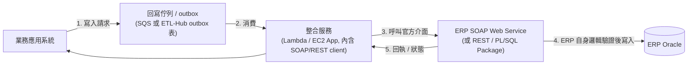

# ERP 回寫可行性確認流程

> **性質**:決策前置文件。用來確認「業務應用系統能否、以及該如何回寫資料到地端 ERP Oracle」。
> **背景來源**:現行架構見 [`aws-to-local-infra-arch.md`](aws-to-local-infra-arch.md)。
> **狀態**:待 ERP 端確認(見〈IV、待確認清單〉);確認後應收斂為一份 ADR(見 [`README.md`](README.md#adr-格式))。

---

## I、問題背景

現行 docs/Arch 這條資料鏈是**單向**的:

```
Oracle →(DMS)→ Raw-Data-Replication →(Glue ETL)→ ETL-Hub → 業務系統「讀取」
```

業務系統目前只**讀** ETL-Hub。本文件要確認的是:**當業務系統想把資料「回寫」到地端 ERP Oracle 時,可不可以做、以及正確的做法是什麼。**

---

## II、結論(先講重點)

1. **不要用 DMS 回寫。** DMS 是單向複製工具,來源端是唯讀帳號(`aws-to-local-infra-arch.md` § 六),硬做反向 task 是架構反模式。
2. **不要直接 INSERT/UPDATE Oracle 底表。** 會跳過 ERP 商業邏輯,造成資料「看得到、但商業意義是錯的」(詳見〈III〉)。
3. **回寫必須走 ERP 認可的官方介面**,讓 ERP 自己執行完整邏輯。優先序:
   - **SOAP Web Service**(若 ERP 有開,且涵蓋所需寫入操作)→ **首選**
   - REST API(若 ERP 有提供)→ 同等可用,通常更輕量
   - DBA 封裝的 PL/SQL Package(含商業邏輯對外提供)→ 次選,需 ERP 團隊額外開發維護
4. **能不能回寫的關鍵不在雲端這側,而在 ERP 有沒有開對應介面** → 見〈IV、待確認清單〉。

---

## III、為什麼不能直接寫 Oracle 底表

核心觀念:**ERP 底表是「結果」,不是「入口」。** 正確的資料狀態是 ERP 跑完一整套邏輯後的產物;從結果端硬塞,資料有了但過程沒發生。直寫會壞在:

| 風險 | 說明 | 後果範例 |
| --- | --- | --- |
| 商業規則沒執行 | 一筆寫入常連帶扣庫存 / 產傳票 / 更新應收 / 檢查信用額度 | 帳實不符、庫存對不上 |
| 資料驗證被繞過 | 金額範圍、必填、狀態機、關聯正確性多寫在應用層 | 塞進 ERP 自己都判定非法的資料 |
| 觸發器 / 序號沒連動 | 主檔↔明細↔彙總一致性、單據序號由 ERP 內部維護 | 資料對不齊、單號撞號 / 跳號 |
| 狀態機被破壞 | 單據狀態(待審→已核→已過帳)有嚴格流轉 | 出現 ERP 邏輯上「不可能」的狀態,後續操作報錯 |

> 一句話:讓 ERP 自己來做這一整套,你只負責把「要做什麼」交給它。

---

## IV、待確認清單(交接重點 — 先問 ERP / DBA)

**這是決定「能不能回寫」的關鍵,務必先問清楚再動工:**

- [ ] **(a) ERP 有沒有對外的 SOAP Web Service(或 REST API)?**
- [ ] **(b) 該介面是否涵蓋要回寫的操作?**(新增 / 更新某單據,還是只有查詢)
- [ ] **(c) 能否取得 WSDL(SOAP)/ API 文件 + 一組測試帳號?**
- [ ] **(d) 若無現成介面 → ERP 團隊能否封裝 PL/SQL Package 對外提供?**
- [ ] **(e) 回寫用的 ERP 帳號授權範圍?**(需與 DMS 唯讀帳號完全分開)
- [ ] **(f) 介面的錯誤碼 / 回執格式?**(供整合服務做錯誤處理與重試判斷)

> 只要 (a)(b)(c) 為「是」,回寫即可行,方向就是「用 SOAP Web Service(或 REST)回寫」。

---

## V、回寫的正確流程(確認可行後的目標架構)



實作要點:

1. **入口用 ERP 官方介面**,由 ERP 負責驗證與完整性,不碰底表。
2. **非同步 + outbox / 佇列**:業務系統先落一筆待回寫紀錄(pending / success / failed),整合服務再消費 → 可重試、可稽核、與讀取鏈解耦。
3. **網路方向要新開一條**:現行 SG 只有 `DMS SG → Oracle 1521`;回寫需新增 `整合服務 → ERP 介面 port`(走同一條 Site-to-Site VPN,**只增不刪**既有規則,符合現行規範)。
4. **權限帳號分離**:回寫用「可寫但受限」的 ERP 帳號 / 介面授權,跟 DMS 唯讀帳號完全分開。

---

## VI、SoapUI 的角色(釐清)

- **SOAP Web Service** = ERP 對外的官方介面(協定)。
- **SoapUI** = 用來**測試 / 探索** SOAP(與 REST)介面的工具。

用途界定:

- ✅ **開發 / 測試階段**:拿 SoapUI 打 ERP 的 SOAP endpoint,確認 operation、WSDL、欄位、回執、錯誤碼 → 摸清介面契約。
- ❌ **不要**把 SoapUI 當 production 回寫元件。正式環境應由整合服務**用程式碼的 SOAP/REST client** 呼叫,才有重試 / 佇列 / 稽核 / 錯誤處理。

---

## VII、決策樹(給接手者快速判斷)

```
ERP 有 SOAP Web Service 且涵蓋所需寫入操作?
├─ 是 ─────────────────────────► 用 SOAP Web Service 回寫 ✅(首選)
└─ 否
   ├─ 有 REST API 且涵蓋? ──────► 用 REST API 回寫 ✅
   └─ 都沒有
      └─ DBA 可封裝 PL/SQL Package? ─► 用 Package 回寫 ✅(次選)
                                  └─ 否 ─► 回寫暫不可行,需 ERP 團隊先開介面 ⛔
                                          (絕不直寫底表 / 不用 DMS 反向)
```

---

## VIII、後續動作

1. 拿〈IV〉的清單去問 ERP / DBA,把答案回填。
2. 若可行:用 SoapUI 測通一支回寫操作 → 確認契約 → 在整合服務實作 → 開 SG 規則。
3. 決策確認後,依 [`README.md`](README.md) 規範開一份 ADR(例:`adr/0001-erp-writeback-via-official-api.md`),
   - **決策**:回寫走 ERP 官方 SOAP Web Service(或 REST)
   - **拒絕方案**:DMS 反向 task、直寫 Oracle 底表(理由見〈III〉)
   - **後果 / Trade-off**:新增整合服務與網路路徑的維運成本;架構由單向資料中樞轉為雙向整合。

---

## 交接備註

本文件停在「確認流程」階段:**回寫是否可行,取決於 ERP 端是否提供官方寫入介面(〈IV〉待確認清單)**,而非雲端這側的技術限制。雲端側的做法已在〈V〉定義完成,只等 ERP 介面確認後即可實作。
